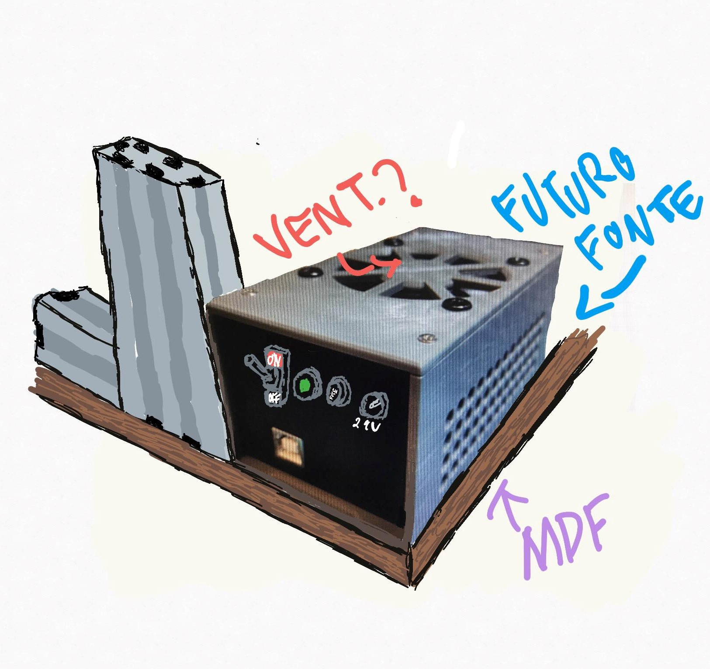

# Rascunhos 
Desenhados no aplicativo **concepts**.

#### Lógica inicialização da medida

******
#### Caixa para eletrônicos
Aletaração no projeto[Arduino CNC Shield Case](https://www.thingiverse.com/thing:4631379) de araymbox publicado no "ThingiVerse

